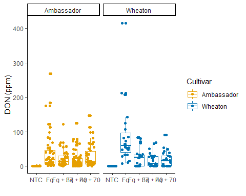
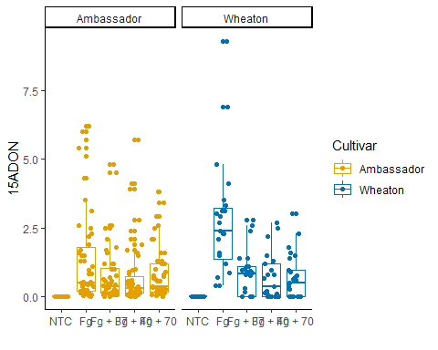
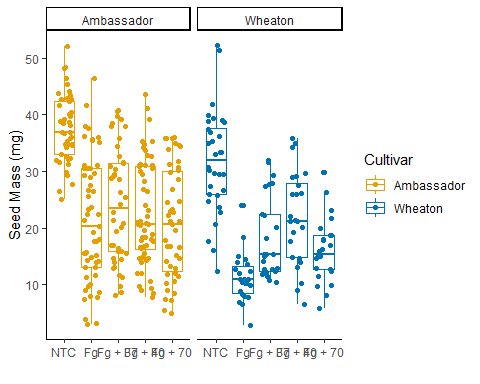
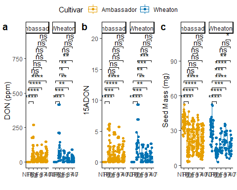

The data used in this project was provided by: Noel, Z.A., Roze, L.V.,
Breunig, M., Trail, F. 2022. Endophytic fungi as promising biocontrol
agent to protect wheat from Fusarium graminearum head blight. Plant
Disease. [See the paper
here](https://doi.org/10.1094/PDIS-06-21-1253-RE)

``` r
#install.packages('tinytex')
#tinytex::install_tinytex()
library(ggplot2)
library(tidyverse)
library(ggpubr)
library(ggrepel)
library(ggprism)
library(knitr)

#getwd()
mycotoxin <- read.csv("MycotoxinData.csv", na.strings = "na")
```

\#Question 2 - Change the factor order level so that the treatment “NTC”
is first, followed by “Fg”, “Fg + 37”, “Fg + 40”, and “Fg + 70”.

``` r
mycotoxin$Treatment <- factor(mycotoxin$Treatment, levels = c("NTC", "Fg", "Fg + 37", "Fg + 40", "Fg + 70"), ordered = TRUE)
```

\#Question 2 Boxplot

``` r
Question_2 <- ggplot(mycotoxin, aes(x = Treatment, y = DON, color = Cultivar)) +
  geom_boxplot() +
  geom_point(position = position_jitterdodge(jitter.width = 0.6)) +
  scale_color_manual(values = c("#E69F00", "#0072B2")) +
  xlab("") +
  ylab("DON (ppm)") +
  theme_classic() +
  facet_wrap(~Cultivar)
Question_2
```

<!-- -->

\#Question 3a - Change the y-variable to plot X15ADON. The y-axis label
should now be “15ADON”.

``` r
Question_3a <- ggplot(mycotoxin, aes(x = Treatment, y = X15ADON, color = Cultivar)) +
  geom_boxplot() +
  geom_point(position = position_jitterdodge(jitter.width = 0.6)) +
  scale_color_manual(values = c("#E69F00", "#0072B2")) +
  xlab("") +
  ylab("15ADON") +
  theme_classic() +
  facet_wrap(~Cultivar)
Question_3a
```

<!-- -->

\#Question 3b - Change the y-variable to plot MassperSeed_mg. The y-axis
label should now be “Seed Mass (mg)”.

``` r
Question_3b <- ggplot(mycotoxin, aes(x = Treatment, y = MassperSeed_mg, color = Cultivar)) +
  geom_boxplot() +
  geom_point(position = position_jitterdodge(jitter.width = 0.6)) +
  scale_color_manual(values = c("#E69F00", "#0072B2")) +
  xlab("") +
  ylab("Seed Mass (mg)") +
  theme_classic() +
  facet_wrap(~Cultivar)
Question_3b
```

<!-- -->

\#Question 5 - Use geom_pwc() to add t.test pairwise comparisons to the
three plots made above. Save each plot as a new R object, and combine
them again with ggarange as you did in question 4.

``` r
Stats_Question_2 <- Question_2 +
  geom_pwc(aes(group = Treatment), method = "t_test", label = "p.adj.signif")
#Stats_Question_2

Stats_Question3a <- Question_3a +
  geom_pwc(aes(group = Treatment), method = "t_test", label = "p.adj.signif")
#Stats_Question3a
  
Stats_Question3b <- Question_3b +
  geom_pwc(aes(group = Treatment), method = "t_test", label = "p.adj.signif")
#Stats_Question3b

#combination graph
Question_5Combo <- ggarrange(Stats_Question_2, Stats_Question3a, Stats_Question3b, labels = "auto",
  nrow = 1,
  ncol = 3, 
  common.legend = T)
Question_5Combo
```

<!-- -->
