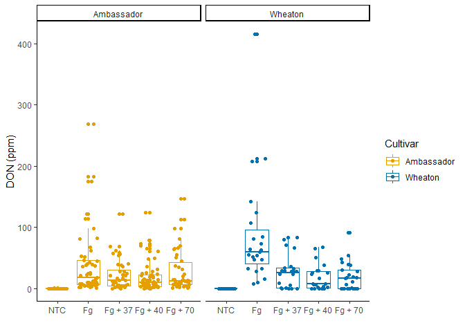
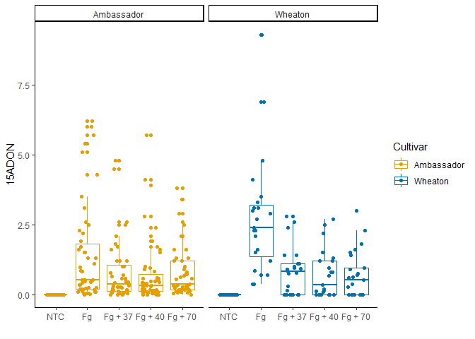
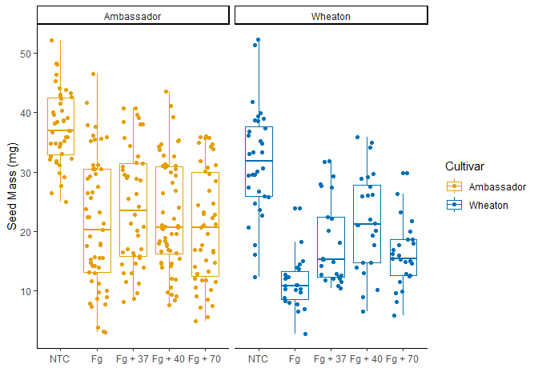
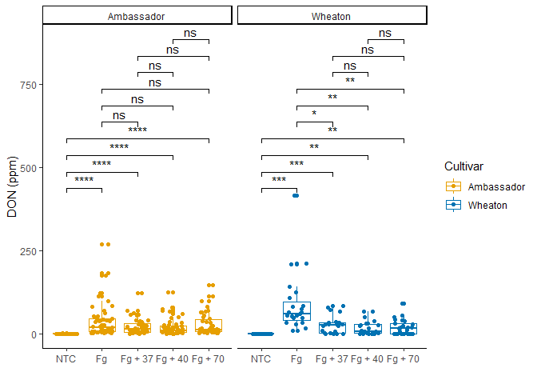
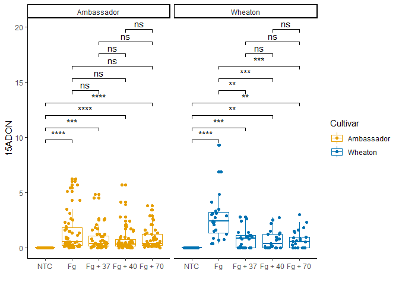
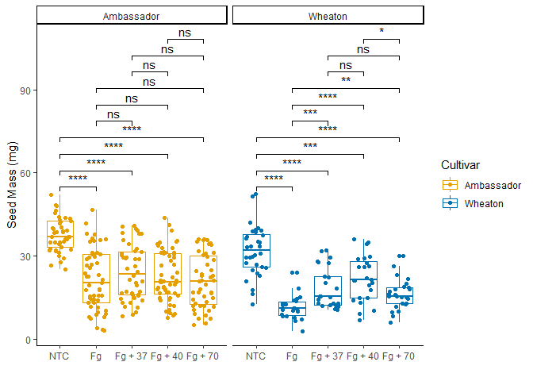

The data used in this project was provided by: Noel, Z.A., Roze, L.V.,
Breunig, M., Trail, F. 2022. Endophytic fungi as promising biocontrol
agent to protect wheat from Fusarium graminearum head blight. Plant
Disease. [See the paper
here](https://doi.org/10.1094/PDIS-06-21-1253-RE)

``` r
library(ggplot2)
```

    ## Warning: package 'ggplot2' was built under R version 4.3.3

``` r
library(tidyverse)
```

    ## Warning: package 'tidyverse' was built under R version 4.3.3

    ## ── Attaching core tidyverse packages ──────────────────────── tidyverse 2.0.0 ──
    ## ✔ dplyr     1.1.2     ✔ readr     2.1.4
    ## ✔ forcats   1.0.0     ✔ stringr   1.5.0
    ## ✔ lubridate 1.9.2     ✔ tibble    3.2.1
    ## ✔ purrr     1.0.1     ✔ tidyr     1.3.0
    ## ── Conflicts ────────────────────────────────────────── tidyverse_conflicts() ──
    ## ✖ dplyr::filter() masks stats::filter()
    ## ✖ dplyr::lag()    masks stats::lag()
    ## ℹ Use the conflicted package (<http://conflicted.r-lib.org/>) to force all conflicts to become errors

``` r
library(ggpubr)
library(ggrepel)
library(ggprism)
```

    ## Warning: package 'ggprism' was built under R version 4.3.3

``` r
#getwd()
mycotoxin <- read.csv("MycotoxinData.csv", na.strings = "na")
```

\#Question 2 - Change the factor order level so that the treatment “NTC”
is first, followed by “Fg”, “Fg + 37”, “Fg + 40”, and “Fg + 70”.

``` r
mycotoxin$Treatment <- factor(mycotoxin$Treatment, levels = c("NTC", "Fg", "Fg + 37", "Fg + 40", "Fg + 70"), ordered = TRUE)
                    

Question_2 <- ggplot(mycotoxin, aes(x = Treatment, y = DON, color = Cultivar)) +
  geom_boxplot() +
  geom_point(position = position_jitterdodge(jitter.width = 0.6)) +
  scale_color_manual(values = c("#E69F00", "#0072B2")) +
  xlab("") +
  ylab("DON (ppm)") +
  theme_classic() +
  facet_wrap(~Cultivar)
Question_2
```

    ## Warning: Removed 8 rows containing non-finite outside the scale range
    ## (`stat_boxplot()`).

    ## Warning: Removed 8 rows containing missing values or values outside the scale range
    ## (`geom_point()`).

<!-- -->

\#Question 3a - Change the y-variable to plot X15ADON. The y-axis label
should now be “15ADON”.

``` r
Question_3a <- ggplot(mycotoxin, aes(x = Treatment, y = X15ADON, color = Cultivar)) +
  geom_boxplot() +
  geom_point(position = position_jitterdodge(jitter.width = 0.6)) +
  scale_color_manual(values = c("#E69F00", "#0072B2")) +
  xlab("") +
  ylab("15ADON") +
  theme_classic() +
  facet_wrap(~Cultivar)
Question_3a
```

    ## Warning: Removed 10 rows containing non-finite outside the scale range
    ## (`stat_boxplot()`).

    ## Warning: Removed 10 rows containing missing values or values outside the scale range
    ## (`geom_point()`).

<!-- -->

\#Question 3b - Change the y-variable to plot MassperSeed_mg. The y-axis
label should now be “Seed Mass (mg)”.

``` r
Question_3b <- ggplot(mycotoxin, aes(x = Treatment, y = MassperSeed_mg, color = Cultivar)) +
  geom_boxplot() +
  geom_point(position = position_jitterdodge(jitter.width = 0.6)) +
  scale_color_manual(values = c("#E69F00", "#0072B2")) +
  xlab("") +
  ylab("Seed Mass (mg)") +
  theme_classic() +
  facet_wrap(~Cultivar)
Question_3b
```

    ## Warning: Removed 2 rows containing non-finite outside the scale range
    ## (`stat_boxplot()`).

    ## Warning: Removed 2 rows containing missing values or values outside the scale range
    ## (`geom_point()`).

<!-- -->

\#Question 5 - Use geom_pwc() to add t.test pairwise comparisons to the
three plots made above. Save each plot as a new R object, and combine
them again with ggarange as you did in question 4.

``` r
Stats_Question_2 <- Question_2 +
  geom_pwc(aes(group = Treatment), method = "t_test", label = "p.adj.signif")
Stats_Question_2
```

    ## Warning: Removed 8 rows containing non-finite outside the scale range
    ## (`stat_boxplot()`).

    ## Warning: Removed 8 rows containing non-finite outside the scale range
    ## (`stat_pwc()`).

    ## Warning: Removed 8 rows containing missing values or values outside the scale range
    ## (`geom_point()`).

<!-- -->

``` r
Stats_Question3a <- Question_3a +
  geom_pwc(aes(group = Treatment), method = "t_test", label = "p.adj.signif")
Stats_Question3a
```

    ## Warning: Removed 10 rows containing non-finite outside the scale range
    ## (`stat_boxplot()`).

    ## Warning: Removed 10 rows containing non-finite outside the scale range
    ## (`stat_pwc()`).

    ## Warning: Removed 10 rows containing missing values or values outside the scale range
    ## (`geom_point()`).

<!-- -->

``` r
Stats_Question3b <- Question_3b +
  geom_pwc(aes(group = Treatment), method = "t_test", label = "p.adj.signif")
Stats_Question3b
```

    ## Warning: Removed 2 rows containing non-finite outside the scale range
    ## (`stat_boxplot()`).

    ## Warning: Removed 2 rows containing non-finite outside the scale range
    ## (`stat_pwc()`).

    ## Warning: Removed 2 rows containing missing values or values outside the scale range
    ## (`geom_point()`).

<!-- -->

``` r
#combination graph
Question_5Combo <- ggarrange(Stats_Question_2, Stats_Question3a, Stats_Question3b, labels = "auto",
  nrow = 1,
  ncol = 3, 
  common.legend = T)
```

    ## Warning: Removed 8 rows containing non-finite outside the scale range
    ## (`stat_boxplot()`).

    ## Warning: Removed 8 rows containing non-finite outside the scale range
    ## (`stat_pwc()`).

    ## Warning: Removed 8 rows containing missing values or values outside the scale range
    ## (`geom_point()`).

    ## Warning: Removed 8 rows containing non-finite outside the scale range
    ## (`stat_boxplot()`).

    ## Warning: Removed 8 rows containing non-finite outside the scale range
    ## (`stat_pwc()`).

    ## Warning: Removed 8 rows containing missing values or values outside the scale range
    ## (`geom_point()`).

    ## Warning: Removed 10 rows containing non-finite outside the scale range
    ## (`stat_boxplot()`).

    ## Warning: Removed 10 rows containing non-finite outside the scale range
    ## (`stat_pwc()`).

    ## Warning: Removed 10 rows containing missing values or values outside the scale range
    ## (`geom_point()`).

    ## Warning: Removed 2 rows containing non-finite outside the scale range
    ## (`stat_boxplot()`).

    ## Warning: Removed 2 rows containing non-finite outside the scale range
    ## (`stat_pwc()`).

    ## Warning: Removed 2 rows containing missing values or values outside the scale range
    ## (`geom_point()`).

``` r
Question_5Combo
```

<!-- -->
